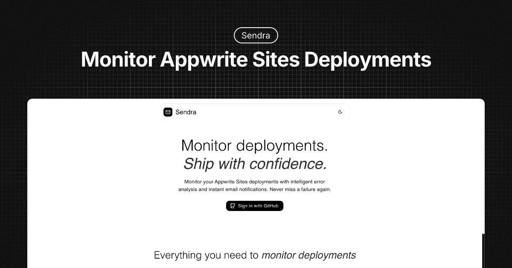

[](https://vercel.com/new/clone?repository-url=https://github.com/AbhiVarde/abhivarde.in)

# 🚀 Sendra MCP - Appwrite Deployment Monitor with Resend MCP

Never miss a failed deployment again! Sendra monitors your Appwrite deployments and sends instant email alerts when something goes wrong.



## 🏆 Hackathon Submission
**Built for:** [Resend MCP Hackathon](https://resend.com/blog/resend-mcp-hackathon) - showcasing MCP integration in a real-world deployment monitoring scenario.

## 🎯 Problem Solved
Appwrite doesn't send email notifications for failed deployments like Vercel does. This MCP version of Sendra demonstrates how to solve this using the Model Context Protocol for email notifications.

## 🔄 MCP vs Production Version
- **Production Sendra**: Uses Appwrite Functions + Direct Resend API → [Live Demo](https://sendra.vercel.app)
- **Sendra MCP**: Uses Local Node.js Server + Resend MCP Protocol → This Repository

## ✨ Key Features
- 🔐 **Secure GitHub Authentication** - Login with your GitHub account
- 📊 **Real-time Dashboard** - View your latest deployment status at a glance
- 🤖 **Resend MCP Integration** - Email notifications via MCP protocol
- 📧 **Smart Email Alerts** - Only sends emails for NEW failed deployments (no spam!)
- 🔒 **Encrypted API Keys** - Your Appwrite credentials are safely encrypted
- ⚡ **Local Development** - Perfect for testing MCP integrations

## 🛠️ Tech Stack
- **Frontend**: Next.js, Material UI, TypeScript (Port 3000)
- **Local MCP Server**: Node.js with Resend MCP (Port 3001)
- **Database**: Appwrite Database
- **Authentication**: GitHub OAuth
- **Email Service**: Resend MCP Protocol
- **Security**: Base64 encryption for API keys

## 🚀 How It Works (MCP Version)
1. **Login** with GitHub
2. **Add** your Appwrite Project ID, API Key, and email
3. **Dual Server Setup** - Frontend (3000) + MCP Server (3001)
4. **MCP Monitoring** - Local server checks deployments every 5 minutes via MCP
5. **Get Alerted** - Receive email notifications through Resend MCP for NEW failures only

## 📦 Installation & Setup

### Prerequisites
- Node.js 18+
- Appwrite account
- Resend account for MCP integration

### Local Development (Dual Terminal Setup)
```bash
# Clone the repository
git clone https://github.com/AbhiVarde/sendra
cd sendra-mcp

# Install frontend dependencies
npm install

# Install MCP server dependencies
cd local-server
npm install
cd ..
```

### Environment Variables
```env
NEXT_PUBLIC_APPWRITE_PROJECT_ID=
NEXT_PUBLIC_APPWRITE_ENDPOINT=
NEXT_PUBLIC_APPWRITE_DATABASE_ID=
NEXT_PUBLIC_APPWRITE_COLLECTION_ID=
NEXT_PUBLIC_FETCH_DEPLOYMENTS_FUNCTION_ID=
```

### Running the Application
```bash
# Terminal 1: Start Frontend Server
npm run dev

# Terminal 2: Start MCP Server
cd local-server
npm start
```

## 🏗️ MCP Architecture
```
Frontend (3000) ↔ Local MCP Server (3001) ↔ Resend MCP ↔ Email Delivery
                              ↕
                        Appwrite Database
```

## 🎯 Hackathon Innovation
- **Real-world MCP Usage**: Demonstrates MCP in actual deployment monitoring
- **Practical Problem**: Fills the gap of missing Appwrite deployment notifications
- **Dual Architecture**: Shows both traditional API and MCP approaches
- **Local Testing**: Perfect environment for MCP development and testing

## 🚧 Development Notes
- Designed specifically for local development and MCP testing
- Requires dual terminal setup (Frontend + MCP Server)
- Not deployed - purely for hackathon demonstration
- Production version available at [sendra.vercel.app](https://sendra.vercel.app)

## 🤝 Contributing
This is a hackathon submission showcasing MCP integration. 
For production contributions, check the main [Sendra repository](https://github.com/AbhiVarde/sendra).

## License

Sendra is licensed under the [MIT License](http://choosealicense.com/licenses/mit/). All rights reserved.

## Authors

Sendra is created and maintained by [Abhi Varde](https://www.abhivarde.in/) for the Resend MCP Hackathon.

---
⭐ **Interested in MCP integration? Give it a star!**